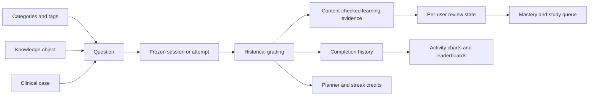

# Backend models and learning logic review — 2026-10-09

The findings below are the original review evidence. They are now addressed in source with the policies and limits recorded in [learning consistency implementation](learningConsistency.md). A matching fresh schema and runtime verification remain pending; this review is not a current unfixed-defect list.

## Assessment and scope

The main relationships are coherent. Frozen assessment records, live learning evidence and user-scoped permissions are deliberately separated. The most useful next work is to make content provenance, learning chronology and activity reporting consistent across those layers, rather than redesigning the models.

Reviewed all eleven application model modules and their persisted invariant hooks; traced the principal question/taxonomy/knowledge, ordinary exam, master exam, offline completion, SRS/mastery, study queue, planner, activity/analytics, feedback, group and account/permission flows. Checked relevant Vue and Android rendering/offline callers. Import/apply mutation boundaries and database administration gates were sampled; not every parser, export/PDF, startup or operator branch was traced. Empty analytics/database model modules are intentional service modules.

This is a production-source review. No production changes, database queries/writes, migrations, automated suites, builds or live HTTP checks were performed. Previously recorded runtime evidence in other reviews applies only to those earlier checks. Findings below describe reachable source behavior, not reproduced production incidents.

## How the models connect

| Model area | Purpose and relationships | Assessment |
| --- | --- | --- |
| User, role capabilities, active sessions | Identity, current access, account lifecycle and session inventory | Capability gates and actual ownership are separate decisions. Role/user overrides and session expiry are established contracts. |
| Category, Tag, QuestionTag | Question classification, hierarchical tags and associations | Appropriate reusable taxonomy; visibility must continue to scope counts and related reads. |
| ClinicalCase, KnowledgeObject, Question | Shared case context, learning concept and assessable variant | A useful distinction: several questions can test one concept, while several case questions can share context. |
| ExamSession, TestHistory, Blueprint/weights | Mutable ordinary session, frozen completion and weighted category selection | Snapshots preserve grading when source content changes. Ordinary automatic selection now considers the caller's previous allocations. |
| MasterExam, membership, attempt, acknowledgement | Curated exam composition, audience/lifecycle, frozen learner attempt and acknowledgements | Fixed exams appropriately preserve their composition instead of applying automatic novelty selection. |
| UserQuestionAttempt | Current per-user/question review state, confidence, errors and schedule | Supports learning beyond exam scores. Content fingerprints prevent obsolete base-content answers from establishing current mastery. |
| StudyPlanner, StudyPlannerDay | Targets and durable daily learning credits | Supports incremental practice; activity charts need to distinguish this ledger from completed-session history. |
| Group, GroupMembership | Learner cohort, audience and leaderboard membership | A group is a cohort, not a question bank. Category/tag/concept/case are the question-grouping relationships. |
| Bookmark, QuestionFlag, QuestionRating | Personal selection and content feedback | Complements study and quality review; toggle transactions alone do not make uncertain client retries safe. |
| OfflineCompletion | Durable idempotent upload receipt | Prevents identical retries from duplicating completion effects; it does not currently record when offline learning occurred. |
| Setting, Tip, PrivilegedAction | Configuration, guidance and administrative audit | Cross-cutting support rather than learning evidence. |

The last two branches explain one reporting mismatch below: valid incremental learning need not have a completed history row.

## Connections worth preserving

- Visibility, capabilities and ownership are checked at service/view boundaries; authored-by attribution is distinct from current ownership. Private questions should remain scoped even when related counts or offline catalogues are read.
- Grading uses frozen content; current mastery uses assessed-content fingerprints. Historical scores should remain valid after an edit without implying mastery of the replacement content.
- Ordinary study/recall records first attempts incrementally with `learning_recorded` markers. Pause, finish and discard should retain real learning without counting the same answer again.
- Ordinary completion identity, locked master completion and offline UUID/body receipts supply different replay protections. Preserve those protections and avoid automatically retrying uncertain writes without reconciliation.
- Current automatic selection preserves eligibility, blueprint quotas, manual IDs, SRS ordering and fixed master composition. Unseen questions are preferred, followed by fewer/older allocations with random ties; see [selection policy](questionSelection.md).

## Prioritized findings

### 1. High — live question statistics include obsolete assessed content

**Evidence:** [question counters](../apps/exams/services/exam_service.py#L713) update by question ID alone. [Completion side effects](../apps/exams/services/exam_service.py#L731) increment those counters before [SRS provenance checks](../apps/learning/srs_service.py#L211). [Question edits](../apps/questions/services/question_service.py#L193) invalidate changed learning evidence, but do not version/reset these counters. [Difficulty calibration](../apps/analytics/services/admin_advanced.py#L69) uses the counters with the current difficulty.

**Example:** a learner starts an exam, an editor replaces the stem/correct answer, then the learner finishes the old snapshot. Historical grading remains legitimate and SRS rejects the outdated evidence, but the live question's answered/correct totals still increase. Existing pre-edit totals also remain attributed to the replacement content.

**Recommendation:** separate historical totals from current assessed-version statistics. Apply the same locked provenance decision to current quality/difficulty counters as to mastery. Keep historical grades intact; merely skipping stale completions does not remove pre-edit counter contamination.

### 2. High — offline synchronization loses learning chronology

**Evidence:** [CompletionRequest](../apps/exams/views/offline_views.py#L50) accepts identity, signed material, answers and elapsed duration, but no occurrence timestamp. [Completion processing](../apps/exams/views/offline_views.py#L212) uses the common side effects and saves history at `timezone.now()`. [SRS](../apps/learning/srs_service.py#L208), [planner](../apps/planning/services.py#L96) and [study streak](../apps/users/models.py#L359) use processing time/current day. Android retains a local start time, but its [upload payload](../../Android/app/src/main/java/com/mukhtabir/android/data/remote/OfflineStudyService.kt#L55) sends duration and answers rather than learning timestamps.

**Examples:** Friday's offline practice uploaded Sunday earns Sunday activity. An older offline wrong answer uploaded after newer online correct practice can become `last_correct=False` and schedule a lapse even though the actual learning order was the reverse. The existing receipt prevents duplicate uploads, not this ordering problem.

**Recommendation:** represent occurrence and receipt time separately, with bounded client times and explicit trust rules. Anchor validation to server-known pack/receipt times; do not trust an arbitrary device clock. Define how delayed events update schedules, daily credits and latest-answer state. Preserve existing completion UUID/body retry compatibility when extending the contract.

### 3. High — assessed translations are outside learning provenance

**Evidence:** [fingerprint content](../apps/learning/evidence.py#L31) includes base stem/choices/answer, base concept content, case stem and image name, but no question or concept translations. [Knowledge evidence fields](../apps/learning/evidence.py#L7) likewise exclude translations. Question translation writes therefore can change the text a learner is assessed on without changing the fingerprint or invalidating mastery.

Both [Android](../../Android/app/src/main/java/com/mukhtabir/android/data/remote/QuestionLocalization.kt#L17) and [Vue](../../frontend/src/utils/localizedQuestion.js) actually render translated question text and translated choices. Thus a semantic correction to translated assessed content can leave old mastery intact and let old translated snapshots qualify as current learning. This differs from explanation-only wording changes, which need not invalidate assessment evidence.

**Recommendation:** define assessed translation/version provenance explicitly. Include relevant translated stems/choices and concept content, or retain a locale-specific assessed version. Decide what invalidates each learner's evidence rather than indiscriminately resetting it for every editorial change.

**Related validation gap:** [translation normalization](../apps/questions/translation_validation.py#L16) bounds translated choice counts independently of the base question, and [question-write validation](../apps/questions/serializers/question_write.py#L63) does not enforce matching counts. Vue/Android guard against mismatched lengths by falling back to base choices, so the supported finding is a mixed-language display, not proven misgrading. Reject incompatible counts and document that translated options must retain the base option/index correspondence.

### 4. Medium — an immediate correct answer can bypass a relearning delay

**Evidence:** [_apply_review](../apps/learning/srs_service.py#L28) prevents early correct practice from earning spaced credit only when the previous answer was also correct ([guard](../apps/learning/srs_service.py#L63)). A wrong answer resets repetitions and schedules a 10-minute/1-hour/6-hour/12-hour relearning step. A correct answer immediately afterward bypasses that guard and starts a successful interval, commonly one day. The [study queue](../apps/learning/services.py#L93) can select fragile/wrong questions without requiring their due time.

**Recommendation:** separate early practice from credited relearning steps. Require the scheduled step to become due before awarding retention/schedule advancement, or define an explicit relearning sequence. Preserve answer/confidence recording and deliberate immediate practice; those are useful even when no spaced credit is earned.

### 5. Medium — planner/streak credit and activity statistics disagree

**Evidence:** [incremental study/recall](../apps/exams/services/exam_service.py#L741) feeds planner and streak effects before final completion. [Daily activity](../apps/exams/services/activity.py#L111) and [group activity](../apps/exams/services/activity.py#L136) derive from completed TestHistory/MasterExamAttempt rows. [Member advanced statistics](../apps/analytics/services/member_advanced.py#L64) count active days from completed sessions while also exposing the stored study streak.

**Example:** answer questions and pause/discard today: mastery, planner and streak can increase, while completed-session charts/leaderboard activity remain zero. Conversely, completing an unanswered exam creates session activity without answered-learning streak credit.

**Recommendation:** either use shared daily learning-event aggregates for metrics advertised as study activity, or clearly label completed-session metrics separately. Do not remove valid incremental learning merely to make charts agree.

### 6. Medium improvement — automatic variety is allocation-based and question-ID-based

**Evidence:** [exposure collection](../apps/exams/services/question_selection.py#L10) reads retained history result IDs and ordinary/master allocation IDs. [Selection](../apps/exams/services/question_selection.py#L47) materializes the full eligible pool and sorts by count/recency. This improves repeated category/tag/blueprint starts, but does not prove a question was displayed or answered.

Known limits: unseen screens allocated to an abandoned session count as exposed; deleting/replacing the only retained allocation/history can lose evidence. Retained SRS evidence is not consulted by this helper. Edited content keeps its old question-ID exposure while learning evidence resets. New variants of the same concept appear unseen. Every start scans the user's retained JSON history, and concurrent selections are not a global atomic reservation. These are also documented in the [existing selection policy](questionSelection.md).

**Recommendation:** add durable, version-aware exposure aggregates distinguishing allocated, presented, answered and mastered. Use indexed summaries for large histories. Add concept diversity within eligible category/tag/blueprint pools and respect clinical-case sibling grouping where appropriate. Preserve deliberate repetition for due reviews, manual selections and curated master exams.

### 7. Policy decision — full-bank permission gates the workflow, not total offline volume

**Evidence:** the catalogue requires `tests.download_full_bank`; [pack requests](../apps/exams/views/offline_views.py#L33) default `full_bank` to false and [the extra gate](../apps/exams/views/offline_views.py#L113) applies only when that client flag is true. Ordinary selected packs still require `tests.start` and independent visibility/readiness checks. The authenticated [question list](../apps/questions/views/question_views.py#L147) can supply accessible public IDs.

A caller denied the bulk capability can obtain successive allowed selected packs without the bulk flag, eventually collecting the accessible bank. This does not grant access to unauthorized questions; it means the permission currently controls the convenient catalogue/bulk workflow rather than enforcing a total-download entitlement.

**Recommendation:** decide whether this matches the intended admin control. A hard restriction needs a server-enforced entitlement/budget across all pack requests, not a caller-declared bulk flag. Revocation cannot erase previously downloaded content from an offline device. No policy was changed by this review.

## Further learning improvements and explicit policy choices

- **Concept coverage:** current concept mastery intentionally averages attempted variants; unseen variants contribute coverage information separately. One repeatedly practiced variant can therefore support a high mastery label at low coverage. Consider requiring minimum distinct variants or reporting qualified mastery/coverage together. See [mastery policy](../apps/learning/mastery.py).
- **Quality of progress:** planner/leaderboard answered-volume counts can reward repeated easy practice even when SRS grants no spaced credit. Add unique concepts, due reviews completed and mastery improvement alongside volume; do not silently redefine existing counters.
- **History retention:** `MasterExamAttempt.master_exam` uses CASCADE; deleting a master exam can remove completed attempts while durable learning/planner credit remains. If learner history is expected to survive administrative cleanup, archive completed exams or retain a standalone immutable completion record. See [attempt relationship](../apps/master_exams/models.py#L263).
- **Adaptive selection:** offer an explicit “new coverage” versus “review weaknesses” balance. Use confidence/error patterns, due concepts and coverage inside the chosen filter; novelty alone is not a complete learning policy. Clinical cases and fixed exams need their own presentation rules.
- **Recovery:** explicit bookmark set/unset and create-operation receipts would improve uncertain-write recovery. Row locks/transactions prevent races but cannot tell a disconnected client whether a toggle or duplication succeeded. Existing Android cross-cutting findings already track those client limits.
- **Concurrent editing:** retain current locked rereads and optional revision checks. Where collaboration needs stale-edit rejection, make the relevant revision contract mandatory and align both clients. Locks alone do not reject a stale same-field replacement.

## Recommended implementation sequence

1. Align assessed-content provenance for live statistics and translations; retain historical grading and distinguish assessment changes from editorial changes.
2. Define offline event chronology and delayed-event merge behavior across SRS, history, planner and streaks; coordinate both server and Android contracts.
3. Correct early relearning credit and reconcile/report daily learning versus completed-session activity.
4. Confirm bulk-permission policy, then add scalable exposure evidence/concept diversity and richer progress metrics.

Each implementation requires focused source changes and explicit runtime scenarios. In particular: edit-during-finish, translation-only correction, wrong→immediate-correct→due-correct, offline-before/after-online ordering, midnight/time-zone boundaries, identical/altered completion retries, pause/discard metrics, deleted history, sparse pools and concurrent starts. Run live DRF and relevant server-database concurrency checks only when authorized. Do not infer deployment/schema readiness or runtime correctness from this report.
